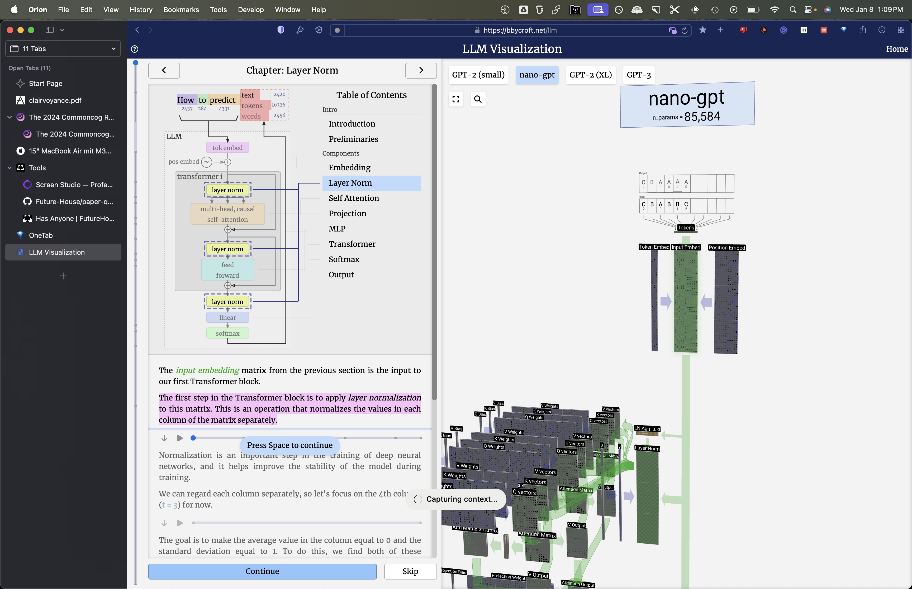
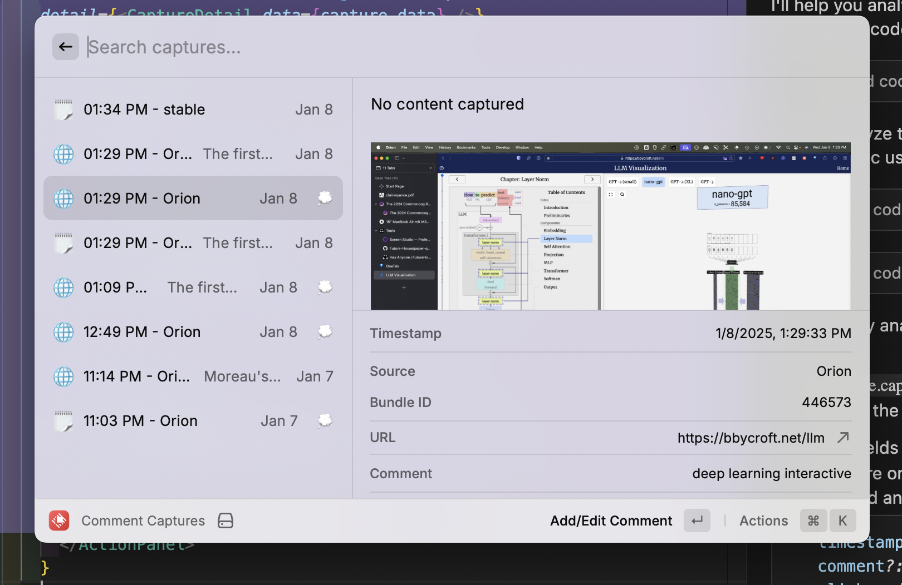

# Raycast Context Capture

Capture content with extra screen and app context, including

- selected text
- an automatic screenshot
- source
- frontmost app
- IF using browser: url, markdown/html of the active tab

Plus, the option to add comments to captures and screenshots. Personally, I use this as a workflow to save and comment points of interest for an AI to analyze.

## Commands

I recommend using `Capture` and `Clipboard Capture` via hotkey.

All captures are saved to the capture directory and have metadata and automatic screenshot added.

1. **Capture**: Silently capture selection in any app.
2. **Clipboard Capture**: Capture clipboard text instantly.
3. **Comment Captures**: Add/edit capture comments.
4. **Comment Screenshots**: Comment on recent screenshots -- once a screenshot is commented it moves to the capture directory.
5. **Manage Directories**: Set capture directory (where to save) and your screenshot directory (where to interact with screenshots from).

## Example

Say I'm on a website and want to capture it + some selected text (bookmark+).

`Capture` will produce these two files:



And the context in json\*:

\*html --> markdown in the newer version

> Sorry, this should've been a flat json instead

```json
{
  "content": {
    "text": "The first step in the Transformer block is to apply layer normalization to this matrix. This is an operation that normalizes the values in each column of the matrix separately.",
    "html": "# LLM Visualization\n\nThe _input embedding_ matrix from the previous section is the input to our first Transformer block.\n\nThe first step in the Transformer block is to apply _layer normalization_ to this matrix. This is an operation that normalizes the values in each column of the matrix separately.\n\nNormalization is an important step in the training of deep neural networks, and it helps improve the stability of the model during training.\n\nWe can regard each column separately, so let's focus on the 4th column (t = 3) for now.\n\nThe goal is to make the average value in the column equal to 0 and the standard deviation equal to 1. To do this, we find both of these quantities (mean (μ) & std dev (σ)) for the column and then subtract the average and divide by the standard deviation.\n\nThe notation we use here is E\\[x\\] for the average and Var\\[x\\] for the variance (of the column of length C). The variance is simply the standard deviation squared. The epsilon term (ε = 1×10\\-5) is there to prevent division by zero.\n\nWe compute and store these values in our aggregation layer since we're applying them to all values in the column.\n\nFinally, once we have the normalized values, we multiply each element in the column by a learned weight (γ) and then add a bias (β) value, resulting in our normalized values.\n\nWe run this normalization operation on each column of the input embedding matrix, and the result is the normalized input embedding, which is ready to be passed into the Self-Attention layer.",
    "screenshot": "/Users/alien/.em/data/screenshot-2025-01-08T12-09-55.951Z.png"
  },
  "source": {
    "app": "Orion",
    "bundleId": "446573",
    "url": "https://bbycroft.net/llm",
    "window": "Orion"
  },
  "metadata": {
    "timestamp": "2025-01-08T12:09:56.303Z"
  }
}
```

If I then want to add a comment to the capture I can use the `Comment Captures` command.



## Configuration

- **Screenshots Directory**: Default `~/Desktop/`
- **Capture Directory**: Default `~/Downloads/`

## Troubleshooting

- Make sure to double check your directories are correct and rerun the manage directories command.
- For extra metadata browser captures (url, markdown) you need to have the raycast browser extension installed.
